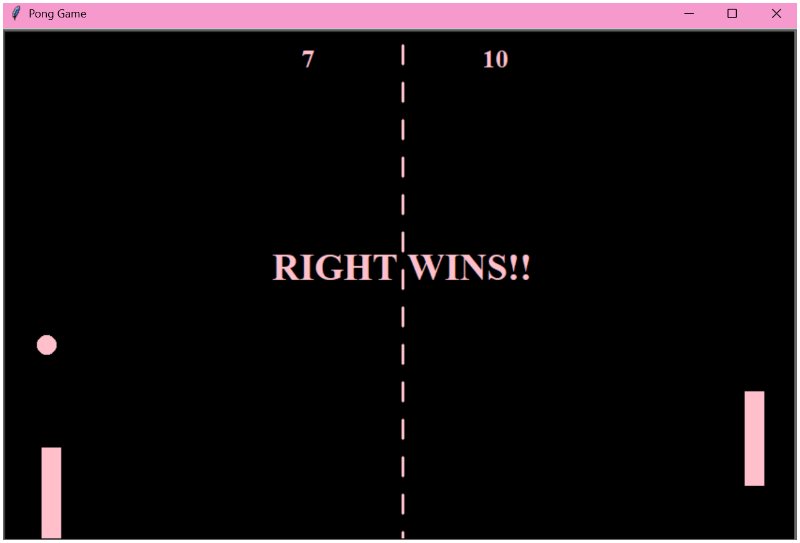

# 🏓 Pong Game

A classic Pong game implementation using Python's Turtle Graphics library.

## 📑 Table of Contents

- [Controls](#-controls)
- [Requirements](#-requirements)
- [How to Play](#-how-to-play)
- [Screenshot](#screenshot)
- [Game Mechanics](#-game-mechanics)
- [Customization](#-customization)

## 🕹️ Controls

### Right Paddle (Player 2)
- **Up Arrow**: Move paddle up
- **Down Arrow**: Move paddle down

### Left Paddle (Player 1)
- **W**: Move paddle up
- **S**: Move paddle down

## 📋 Requirements

- Python 3.x
- Turtle graphics library (included with Python)

## 🎯 How to Play

1. Run `main.py` to start the game
2. Each player controls their paddle to hit the ball
3. If the ball passes your paddle, your opponent scores a point
4. The ball speeds up each time it hits a paddle (speed resets at each score)
5. First to score 10 points wins!!

## Screenshot

## ⚙️ Game Mechanics

- **Ball Physics**: The ball bounces off the top and bottom walls, and reverses direction when hitting paddles
- **Speed System**: Ball speed increases by 10% after each paddle collision, resetting after each score
- **Collision Detection**: Uses distance-based detection for paddle hits
- **Boundary System**: Ball resets to center when it goes out of bounds

## 🎨 Customization

You can easily customize the game by modifying `config.py`:

- `W_HEIGHT`: Window height (default: 550)
- `W_WIDTH`: Window width (default: 850)
- `BASE_SPEED`: Initial ball speed (default: 0.1)

---

## Enjoy the game! 🏓