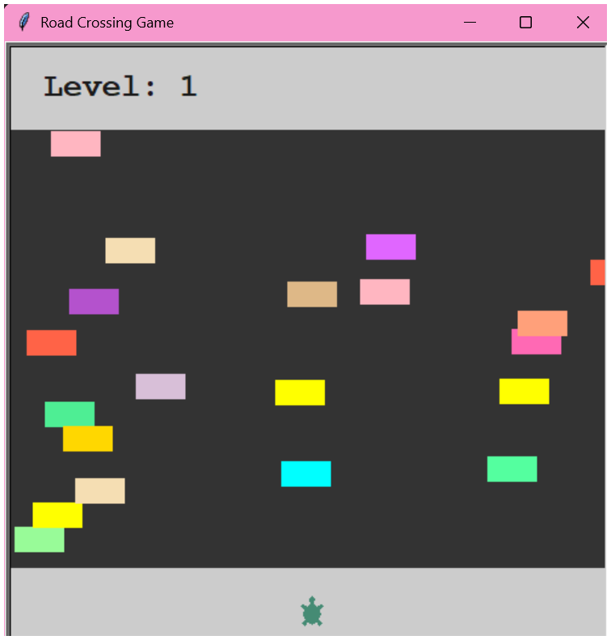
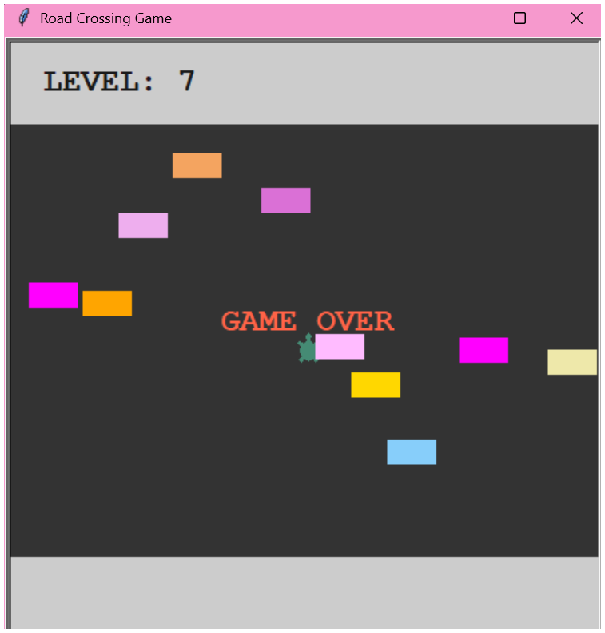

# 🐢 Road Crossing Game

Built with Python's Turtle Graphics library. Guide your turtle safely across a busy road filled with speeding cars.

## 📑 Table of Contents

- [Screenshots](#-screenshots)
- [Features](#-features)
- [Controls](#-controls)
- [Requirements](#-requirements)
- [How to Play](#-how-to-play)
- [Game Mechanics](#-game-mechanics)
- [Customization](#-customization)

## 📸 Screenshots

## 🎮 Features

- **Progressive difficulty**: Car speed increases with each level
- **Random car generation**: Cars spawn at random intervals for unpredictable gameplay
- **Colorful graphics**: 45+ different car colors for visual variety
- **Level tracking**: Keep track of how many times you've crossed the road
- **Collision detection**: Collision detection between turtle and cars
- **Endless gameplay**: Play as long as you can survive!

## 🕹️ Controls

- **Up Arrow**: Move turtle forward
    ### Note:
    PLayer turtle can only move forward, not backwards, right or left.

## 📋 Requirements

- Python 3.x
- Turtle graphics library (included with Python)

## 🎯 How to Play

1. Run `main.py` to start the game
2. Your turtle starts at the bottom of the screen
3. Press the **Up Arrow** to move forward
4. Successfully cross to the top to level up
5. Game ends when you collide with a car

## ⚙️ Game Mechanics

- **Player Movement**: One-directional movement (upward only) with 10-pixel steps
- **Car Generation**: Random car spawning with 20% chance each frame
- **Car Colors**: 45+ different colors randomly assigned to each car
- **Speed Progression**: Base speed of 5 pixels, increases by 20% per level
- **Collision System**: Distance-based detection with 20-pixel threshold
- **Level Up**: When reaching the top edge of the road
- **Spawn Position**: Cars spawn just outside the right edge with random Y positions within road bounds

## 🎨 Customization

You can easily customize the game by modifying `configure.py`:

- `W_HEIGHT` / `W_WIDTH`: Window dimensions (default: 500x500)
- `car_speed`: Initial car speed (default: 5)
- `increase_speed_by`: Speed multiplier per level (default: 1.2 = 20% increase)
- `ROAD_EDGE_Y`: Road boundary size (default: 180)
- `colors`: List of available car colors (45 colors included)
- `FONT`: Display font for level and game over text

You can also customize the player appearance in `player.py` (default: aquamarine turtle).

---

### Good luck crossing the road! 🚗💨🐢